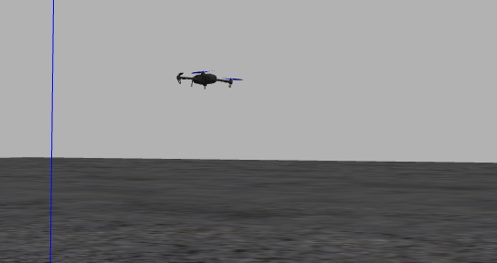

## Jetski Simulations PX4
This repo serves as prove of concept for guidance, navigation and control for jetskies powered by the PX4 autopilot in Gazebo.

## Getting started
We advise to use Docker to run both PX4 and the offboard application. 
One can refer to the following link for the details of docker installation
[PX4 ROS2 Docker](https://github.com/alisrour97/px4-dev-simulation-ros2-humble.git)


### 2) Clone this repository
Open a terminal, go in the folder where you want to clone this repository and run the command
```
git clone https://github.com/alisrour97/Sensitivity_PX4_Experiments.git --recursive
```

### 3) Clone PX4 firmware
Clone the firmware repository, in the same folder where you cloned this repository
```
git clone https://github.com/PX4/PX4-Autopilot.git --recursive
```

### 4) Clone the uXRCE-DDS client 
This is the client needed to communicate with PX4 from ROS2.
```
git clone https://github.com/eProsima/Micro-XRCE-DDS-Agent.git
cd Micro-XRCE-DDS-Agent
mkdir build
cd build
cmake ..
make
```
### 5) Create the docker container
Go into the sensitivity_experiment folder and run the script to create the container (N.B: you must be in the sensitivity_experiment folder)
```
cd Sensitivity_PX4_Experiments
source create_px4_container.sh 
```
Now you should be inside the container, and if you run the command ```ls```, you will see the two folders
To close the container just press ```CTRL-d```. The container will be closed but not removed, so you can start it again whenever you need. If, instead, you need to remove the container for some reason, run the command
```
docker container rm px4_ros2
```
and repeat the step (5) to create it again.

## Run the simulation
Now that everything is set up, you need to compile PX4 in order to run the simulation, start the uXRCE-DDS client and then start the controller in ROS2.
Remember that to build PX4 and to run the controller you must be inside the docker container, otherwise you will miss the dependencies to do that (to start the uXRCE-DDS client you must not be in the container if you compiled it outside the container).

### 1) Start the PX4 simulation
Considering that we will use the Gazebo GUI, in every terminal where you will start the container or open a terminal into it, first run the command
```
xhost +
```

If you closed the container, then start it with the command
```
docker start px4_ros2
docker attach px4_ros2
```
If instead you have already started the container in a terminal and want to open another terminal in the container, run the command
```
docker exec -u 0 -it px4_ros2 bash
```
In the container, go in the firmware folder and build it to start the simulation
```
cd PX4-Autopilot
make px4_sitl gazebo-classic
```
At the end of the building process you will see the Gazebo simulation opened.

### 2) Start the communication client
Open a new terminal and go into the repository and start the client
```
cd Micro-XRCE-DDS-Agent/build
./MicroXRCEAgent udp4 -p 8888
```

### 3) Start the ROS2 application
Open a new terminal in the container and, only for the first time, build the ROS2 workspace
```
xhost +
docker exec -u 0 -it px4_ros2 bash
source ../../opt/ros/foxy/setup.bash
cd Sensitivity_PX4_Experiments
colcon build
```
At the end of the building process, or if you already have built before, run the commands
```
source install/setup.bash
ros2 run trajectory_publisher trajectory_publisher
```
You should see IRIS moving with feedforward trajectory of duration 5 seconds




### 4) Alternative way to run many perturbed simulations

```
cd Sensitivity_PX4_Experiments
```


A script to simulate a trajectory with 9 perturbed simulations

```
python3 -m simulate.py <trajectory_file_name> <trajectory_duration_in_seconds>

```
Make sure that you have permission to run simulate.py script by running

```
sudo chmod +x simulate.py

```

The log files are found when navigating to

```
cd ../PX4-Autopilot/build/px4_sitl_default/rootfs

```

Sometimes you have to run the following to get permission to plot logs in plotjuggler 

```
sudo chown -R tesla:tesla *

```
my username is tesla

## Experiments Real Drone
First you should be on the same wifi network as the drone WifiVicon, then you connect to the drone
via ssh followed by username/id:

```
ssh nvidia@192.168.30.165
```
Make sure that the drone is recognized by Qualysis/Vicon on the Mocap desktop

The the next step would be to open the Mavlink shell on the px4 to enable communication

```
python3 PX4-Autopilot/Tools/mavlink_shell.py

```
Then you type the following:

```
micrortps_client start -t UART
mavlink stop-all

```
After that you can safely close that terminal

on your laptop you need the following package as to run atomatic script:

```
sudo apt install sshpass
```

Automatic script start_Acanthis.sh:

```
./start_Acanthis.sh

```
which does the following: connect to drone/ starting docker/ changing the directory to sensitivity experiments
and sourcing the "setup.bash" which is translated in the following commands:

```
ssh nvidia@192.168.30.165
docker start sens_exp
docker exec -u 0 -it sens_exp
cd sens_ws/Sensitivity_PX4_Experiments
source install/setup.bash

```

Then you can start the MicroRTPS Agent to publish and subscribe to the drone nodes

```
micrortps_agent -t UART

```

In another terminal you also do the following as to make visp node "visp_odom" publish to the drone the position

```
./start_Acanthis.sh
ros2 run visp_odom visp_odom

```

Then in another terminal you can run the trajectory publisher with:


```
./start_Acanthis.sh
ros2 run trajectory_publisher trajectory_publisher --ros-args -p file_name:="your_file.csv"

```

To transfer CSV files, do the following:

```
scp directory_of_file/File.csv nvidia@192.168.30.165:~/sens_ws/sensitivity_experiment/src/trajectory_publisher/csv_file

```

To listen to vehicle different topics:

```
ros2 topic list
ros2 topic echo /fmu/vehicle_visual_odometry/in
ros2 topic echo /fmu/vehicle_odometry/out
ros2 topic echo /fmu/vehicle_control_mode/out
ros2 topic echo /fmu/vehicle_status/out


```

If in case you changed visp_odom node or trajectory publisher you have to build it again by:

```
colcon build --packages-select visp_odom --symlink-install
colcon build --packages-select trajectory_publisher

```


## Authors
Ali Srour <br>
Salvatore Marcellini <br>
Tommaso Belvedere <br>

