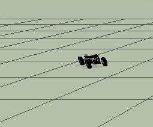

## Jetski Simulations PX4
This repo serves as prove of concept for guidance, navigation and control for jetskies powered by the PX4 autopilot in Gazebo.

## Getting started

### 1) Docker Image Build
We advise to use Docker to run both PX4 and the offboard application. 
One can refer to the following link for the details of docker installation
[PX4 ROS2 Docker](https://github.com/alisrour97/px4-dev-simulation-ros2-humble.git)


### 2) Clone Repo (ROS WS)
Open a terminal, go in the folder where you want to clone this repository and run the command
```
git clone https://github.com/alisrour97/px4_jet_ski.git --recursive
```
The **--recursive** flag is required to fetch all of the PX4 messages or other submodules if any.


### 3) Clone PX4 Autopilot (Firmware)
Clone the firmware repository, in the same folder where you cloned this repository
```
git clone https://github.com/PX4/PX4-Autopilot.git --recursive
```
The **--recursive** flag is required to fetch all of the PX4 submodules.


### 4) Clone UXRCE-DDS Client 
This is the client needed to communicate with PX4 from ROS2. choose a version between **V2.4.0** and **V2.4.2** which are the latest 
stable versions supported

```
git clone -b foxy https://github.com/eProsima/Micro-XRCE-DDS-Agent.git
cd Micro-XRCE-DDS-Agent
mkdir build
cd build
cmake ..
make
sudo make install
sudo ldconfig /usr/local/lib/
```


## Run the simulation

### 1) Start PX4 Simulation
Considering that we will use the Gazebo GUI, in every terminal where you will start the container or open a terminal into it, first run the command
```
xhost +
```

If you closed the container, then start it with the command
```
docker start px4_ros2
docker attach px4_ros2
```
If instead you have already started the container in a terminal and want to open another terminal in the container, run the command
```
docker exec -u 0 -it px4_ros2 bash
```
In the container, go in the firmware folder and build it to start the simulation
```
cd PX4-Autopilot
make px4_sitl gz_rover_ackermann
```
At the end of the building process you will see the Gazebo simulation opened.

### 2) Start the communication client
Open a new terminal outside docker and go into the **build** repository of the DDS Agent and launch

```
cd Micro-XRCE-DDS-Agent/build
./MicroXRCEAgent udp4 -p 8888
```


### 3) Start the ROS2 application
Open a new terminal in the container and, only for the first time, build the ROS2 workspace
```
xhost +
docker exec -u 0 -it px4_ros2 bash
cd PX4_Experiments
source /opt/ros/humble/setup.bash
colcon build
```

At the end of the building process, or if you already have built before, run the node

```
source install/setup.bash
ros2 run trajectory_publisher rover_publisher
```
You should see Rover Ackermann moving toward specific position




### 4) Log files

The log files are found when navigating to

```
cd ../PX4-Autopilot/build/px4_sitl_default/rootfs

```

Sometimes you have to run the following to get permission to plot logs in plotjuggler 

```
sudo chown -R tesla:tesla *

```
my username is tesla


## Authors
Ali Srour <br>

